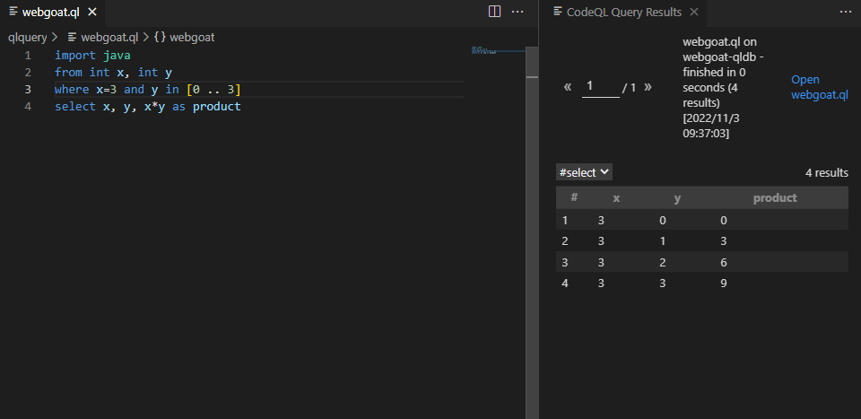
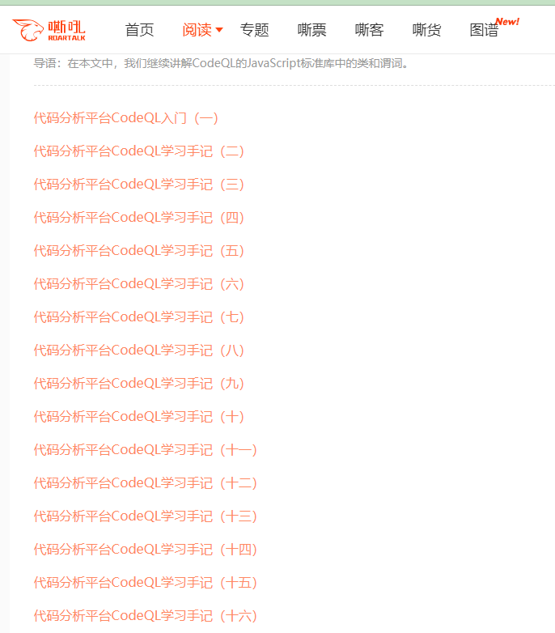
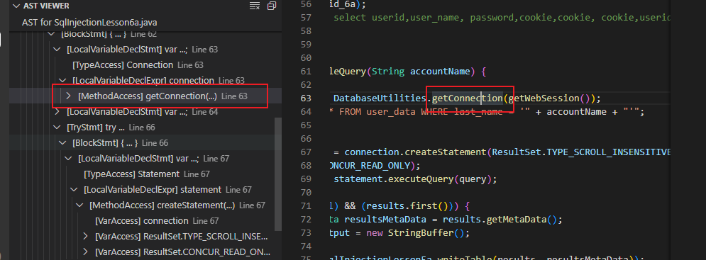

## 最基本的了解

使用Java库，需要导入，也就是需要

`import java`导入java库

`from` 定义变量

`where`表示循环

`select`表示打印

`as $name`表示前面的值重新赋给一个值给`$name`，说直白点就是起了一个别名，也可以叫标签。

`order by`表示排序，可升序可降序，在`查询`操作中会提到

具体使用在下面的操作中会使用较多，慢慢也会熟悉。

## 谓词

这个可以理解为函数吧，在codeql中有内置谓词，还可以自定义谓词。定义谓词的关键词为：`predicate`

codeql的内置谓词：https://codeql.github.com/docs/ql-language-reference/ql-language-specification/#built-ins

1. 自定义谓词

关于自定义谓词的标准和条件（其他都和定义函数类似，需要注意的已经标红）

1、对于没有返回值的谓词使用predicate关键字标记，拥有返回值的谓词使用返回值对应的数据类型标记。

2、谓词的名称，使用小写字母开头的标识符。

3、谓词的参数，使用逗号分隔。需要指定参数类型。

4、谓词体本身，用大括号包裹起来。

在定义拥有返回值的谓词时，需要表明绑定行为，使用bindingset[]注解表示限定参数。

```java
import java
bindingset[str,len]
string truncate(string str, int len) {
    if str.length() > len
    then result = str.prefix(len)
    else result = str
  }

select truncate("helloworld", 5)
```

结果


## 查询

1. 基本查询

```java
import java
//定义两个变量x, y
from int x, int y
//循环使用x(直接赋值)和y(y在0-2的范围内)
where x = 3 and y in [0 .. 2]	//这里使用两个点表示中间的数字
//输出x, y, x*y的值，注意这里x*y的结果重新给了一个名称（标签）
select x, y, x * y as product
```

结果



1. 两种输出排序方式

```java
//只需要在select后面继续操作就可以
select x, y, x*y as product, "product: ", product order by y desc//降序
select x, y, x*y as product, "product: ", product order by y asc//升序（不写默认升序）
```


1. query谓词

query谓词是一个非成员谓词，它返回谓词主体计算得出的所有数组

使用示例

```java
import java
query int getProduct(int x, int y) {
    x = 3 and
    y in [0 .. 3] and
    result = x * y
  }
```


## 类型(Type)

1. 内置原始类型

boolean：此类型包含值true和false

float：此类型包含 64 位浮点数，例如6.28和-0.618

int：此类型包含 32 位二进制补码整数，例如-1and 42

string：此类型包含 16 位字符的有限字符串

date：此类型包含日期（和可选的时间）

1. 类

在codeql中，类也属于type，可以自定义类，但是这里的类，也就是class，是不能创建对象的，只表示一个逻辑。

1、使用class关键字

2、指定类的名字，类名的首字母用大写

3、指定继承的type

4、类的body部分

```java
class OneTwoThree extends int {
    OneTwoThree() { // characteristic predicate
      this = 1 or this = 2 or this = 3
    }
  
    string getAString() { // member predicate
      result = "One, two or three: " + this.toString()
    }
  
    predicate isEven() { // member predicate
      this = 2
    }
  }
```

至于这个类怎么调用？依旧是使用from来定义变量，只不过形式变了一下

```java
from OneTwoThree i//注意类型是类名
select i, i.getAString()
```


1. 重写成员谓词

一个类从父类那边继承了一个成员谓词，就可以重写这个谓词，方法就是在子类中定义一个和继承的谓词相同名称的谓词，然后在前面增加一个override标识。

```java
class OneTwo extends OneTwoThree {
  OneTwo() {
    this = 1 or this = 2
  }

  override string getAString() {
    result = "One or two: " + this.toString()
  }
}
```

关于继承，如果此时声明

```java
from OneTwoThree i
select i, i.getAString()
```

那么，此时结果是


在一个类存在子类的情况下，子类会覆盖父类，也就是父类子类都有的，执行子类的。

再多一个也是一样覆盖

```java
class TwoThree extends OneTwoThree {
  TwoThree() {
    this = 2 or this = 3
  }

  override string getAString() {
    result = "Two or three: " + this.toString()
  }
}
```


这里就没有执行父类的了，因为它有的，两个子类中都有。

关于多继承

当继承多个类的时候，而且在两个父类中有同样的谓词，这里具体继承哪一个父类的谓词需要强制子类重写一个相同的谓词来特别指出。

在多继承中，如果子类继承了相同谓词名称的多个不同的定义，为了避免引起歧义子类需要重写这个谓词。

```java
class Two extends OneTwo,TwoThree{
    override string getAString() {
        result = OneTwo.super.getAString()
      }
}
```


## 模块

1. 文件模块

每个查询文件（扩展名`.ql`）和库文件（扩展名`.qll`）都隐含地定义了一个模块。模块与文件同名，但文件名中的任何空格都替换为下划线 (`_`)。文件的内容构成了模块的主体。

1. 库模块

库模块由`.qll`文件定义

```java
class OneTwoThree extends int {
  OneTwoThree() {
    this = 1 or this = 2 or this = 3
  }
}
```

1. 查询模块

查询模块由`.ql`文件定义

a. 无法导入查询模块。

b. 一个查询模块必须在其`namespace`中至少有一个查询。这通常是一个`select`子句，但也可以是一个`query`谓词。

结合上面的库模块

```java
import OneTwoThreeLib

from OneTwoThree ott
where ott = 1 or ott = 2
select ott
```

1. 显式模块

可以在另一个模块中定义一个模块。这是一个明确的模块定义

显式模块是用关键字定义的，module后跟模块名称，然后是用大括号括起来的模块主体

```java
module M {
  class OneTwo extends OneTwoThree {
    OneTwo() {
      this = 1 or this = 2
    }
  }
}
```

## 逻辑关系/利用类/谓词/递归

从这里学习



当然，其中前八篇文章是讲的通过例子来熟悉各种逻辑怎么去使用，比较友好。推荐

地址：https://www.4hou.com/posts/yJOW

从第九篇后面开始就是根据具体一种语言，因为文章中是以python为例的，而且还不太一样，所以暂时先放置。后面的等先学了Java后再学习。

## 类库

| 名称         | 解释                                                         |
| ------------ | ------------------------------------------------------------ |
| Method       | 方法类，Method method表示获取当前项目中所有的方法            |
| MethodAccess | 方法调用类，MethodAccess call表示获取当前项目当中的所有被调用的方法 |
| Parameter    | 参数类，Parameter表示获取当前项目当中所有的参数              |

以webgoat项目中的一个文件为例，查看它的AST语法树

Method：获取当前项目中的所有方法


MethodAccess：获取当前项目中被调用的方法



Parameter：获取当前项目中的所有的参数


这样就好理解了。

## 公式

类型检查，也就是可以使用类型检查公式来对一个表达式进行检查是否有某种类型

```java
<expression> instanceof <type>
```

像这里，

```java
class MySource extends DataFlow::Node {
    MySource() {
      exists(Annotation ann,AnnotationType anntp|
        this instanceof RemoteFlowSource or (
            anntp.hasQualifiedName("org.springframework.web.bind.annotation", "RequestParam") and
            ann.getType() = anntp and
            this.asParameter().getAnAnnotation() = ann
            )
      )
    }
}
class MyTaintTrackingConfiguration extends TaintTracking::Configuration {
    MyTaintTrackingConfiguration() {
        this = "MyTaintTrackingConfiguration"
    }

    override predicate isSource(DataFlow::Node source) {
        source instanceof MySource
    }

    override predicate isSink(DataFlow::Node sink) {
        exists(Call call |
            sink.asExpr() = call.getArgument(0) and
            call.getCallee().hasQualifiedName("java.sql", "Statement", "executeQuery")
        )
    }
}
```

