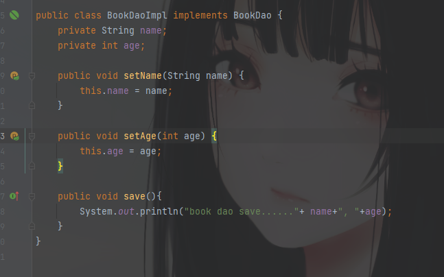
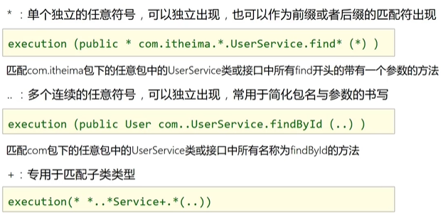

## Spring

### IOC
IOC概念：（Inversion of Control）控制反转，IOC就是一个对象管理容器，在调用对象时就无需主动new去生成对象，而是又IOC容器提供。<br />Spring框架实现了这个思想，提供了IOC容器来充当IOC思想的"外部"<br />IOC容器负责对象的创建，初始化等一些列工作，被创建或者被管理的对象在IOC容器中被称为Bean<br />DI：（Dependency Injection）依赖注入，在容器中建立Bean与Bean之间的依赖关系的整个过程，称为依赖注入。
> 现在有一个Service对象，需要运行，那么我需要去容器中取出来这个Service对象，但是Service运行必须依赖Dao对象才可以运行，所以就还得从IOC中取出来Dao对象。这就不是一个一个取出了，而是两个一块取出来，就是一种依赖关系，所以是依赖注入。

IOC主要是一个将创建对象的操作都放在配置文件中，然后通过加载配置文件<br />导入Spring坐标
```xml
<dependencies>
        <dependency>
            <groupId>org.springframework</groupId>
            <artifactId>spring-context</artifactId>
            <version>5.2.10.RELEASE</version>
        </dependency>
</dependencies>
```
需要有Spring的配置文件，一般命名为applicationContext.xml文件，在这里配置对应类作为Spring管理的bean<br />当然bean在定义时有一些需要主义的地方，看下面配置文件具体写法。
```xml
<?xml version="1.0" encoding="UTF-8"?>
<beans xmlns="http://www.springframework.org/schema/beans"
       xmlns:xsi="http://www.w3.org/2001/XMLSchema-instance"
       xsi:schemaLocation="http://www.springframework.org/schema/beans http://www.springframework.org/schema/beans/spring-beans.xsd">
<!--        1. 导入spring的坐标spring-context, 对应版本是5.2.10.RELEASE-->

<!--            2. 配置bean
                    bean标签表示配置bean, id表示给bean起一个名字, class表示给bean定义类型
-->
    <bean id="bookDao" class="com.itheima.dao.impl.BookDaoImpl"/>
    <bean id="bookService" class="com.itheima.service.impl.BookServiceImpl"/>
</beans>
```
获取IOC容器
```java
//获取IOC容器
ApplicationContext applicationContext = new ClassPathXmlApplicationContext("applicationContext.xml");
//获取bean
BookDao bookDao = (BookDao) applicationContext.getBean("bookDao");//(类型强制转换)
```
注意在获取IOC容器时，一般使用ClassPathXmlApplicationContext()，因为ApplicationContext不是个类，而是接口。<br />
<a name="KLbMF"></a>

### DI
在这里主要就是要删除业务层中使用new的方式创建的dao对象（为了降低耦合度）<br />不使用new的方式去创建对象，那么就需要提供一个set方法，这是IOC提供的对象进入业务层的方法。<br />现在配置需要的对象的依赖关系
```xml
<bean id="bookDao" class="com.itheima.dao.impl.BookDaoImpl"/>
<bean id="bookService" class="com.itheima.service.impl.BookServiceImpl">
<!--配置service与dao的关系-->
      <property name="bookDao" ref="bookDao"/> <!--两个bookDao的关系，第一个是指赋值给谁？是指service的一个属性；第二个bookDao是指需要将谁（指一个bean的id）赋值给第一个bookDao-->
</bean>
```
搞清楚这个依赖关系，谁依赖谁
### Bean
#### bean的基础配置
属性

1. id：在容器中id值唯一，用来获取对应的bean
2. class：bean的类型，即配置的bean的全路径类名

类的别名<br />bean标签中有个name属性，使用来定义bean的别名的，看案例
```xml
<bean id="bookDao" name="dao bookDao2, dao2; dao3" class="com.itheima.dao.impl.BookDaoImpl"/>
```
可以看到，这里的name中的值，我定义了很多个别名，都是可以自定义的，按照自己的命名习惯来。<br />其中可以很明显的观察到：可以定义很多个类名，然后分隔符可以使用空格/逗号/分号<br />作用范围<br />spring创建的bean默认是一个单例实例。类似于new的对象都是一个对象，内存地址都一样<br />用scope可以配置 是否单例，默认值为singleton（单例）换用prototype就会发现生成的对象是不同的对象了，内存中的地址也不一样。<br />F：默认为单例？<br />Q：如果每用一个就创建一个新的，那么对IOC容器来说，压力也会很大。效率也会更高。<br />当然也不是全都适合单例的，不然也不会存在这个非单例的类型了，适合交给IOC管理器进行管理的bean都有：表现层对象（Servlet），业务层对象（Service），数据层对象（Dao），工具对象。<br />不适合交给容器管理的bean：封装实体的域对象
#### bean的实例化
创建bean的三种形式

1. 提供可访问的构造方法（不论public or private）目前最常用

Spring创建对象的时候调用的是无参的构造方法，如果没有无参的构造方法，则会报错。

2. 静态工厂（了解即可）

创建一个factory.java类
```java
import com.itheima.dao.OrderDao;
import com.itheima.dao.impl.OrderDaoImpl;

public class OrderDaoFactory {
    public static OrderDao getOrderDao(){
        return new OrderDaoImpl();
    }
}
```
怎么去创建并调用<br />首先在配置文件中声明
```xml
<bean id="orderDaoFactory" class="com.itheima.factory.OrderDaoFactory" factory-method="getOrderDao"/>
```
这个factory-method是要说明是工厂中的哪个方法来创建对象的。<br />调用方法去创建对象
```java
OrderDao orderDao = OrderDaoFactory.getOrderDao();
orderDao.save();
```
#### bean的生命周期
关于从创建到销毁的过程<br />首先在Impl文件中创建相对应的初始化方法，和销毁方法
```java
//初始化
public void init(){
    System.out.println("init.....");
}
//销毁
public void destory(){
    System.out.println("destory......");
}
```
然后在配置文件中加上相应的属性说明：init-method和destory-method
```xml
<bean id="bookDao" name="dao bookDao2, dao2; dao3" class="com.itheima.dao.impl.BookDaoImpl" init-method="init" destroy-method="destory"/>
```
一般在程序执行完毕，Java虚拟机都是直接关闭的，所以一般没有机会执行销毁方法<br />如果注册一个关闭容器的钩子，提醒Java虚拟机在推出前先关闭容器。
```java
registerShutdownHook();//注册关闭容器钩子
```
另一种Spring自用的生命周期控制方法<br />调用InitializingBean, DisposableBean 中的两个方法分别是destory()和afterPropertiesSet()
```java
import com.itheima.dao.BookDao;
import com.itheima.service.BookService;
import org.springframework.beans.factory.DisposableBean;
import org.springframework.beans.factory.InitializingBean;

public class BookServiceImpl implements BookService, InitializingBean, DisposableBean {
    private BookDao bookDao;
    public void save(){
        System.out.println("book service save .....");
        bookDao.save();
    }

    public void setBookDao(BookDao bookDao) {
        this.bookDao = bookDao;
    }

    @Override
    public void destroy() throws Exception {
        System.out.println("service destory.....");
    }

    @Override
    public void afterPropertiesSet() throws Exception {
        System.out.println("service init.....");
    }
}
```
这样就无需在配置文件中添加init-method和destory-method属性了。
### 依赖注入方式

#### Setter注入

1. 引用类型

setter注入就是在bean中定义引用类型属性并提供可访问的set方法<br /><br />在配置文件中，使用<property>标签的ref属性来注入简单的数据。<br />

2. 简单类型

就是需要传入简单的值的时候，不再使用ref属性，ref属性只能是引用一个bean，而传值则使用的value值。
```java
<bean id="bookDao" name="dao" class="com.itheima.dao.impl.BookDaoImpl">
    <property name="age" value="19"/>
    <property name="name" value="m0re"/>
</bean>
```
<a name="q7A6P"></a>
#### 构造器注入
构造器注入同样是简单类型和引用类型，与Setter类型不一样的地方就是使用的标签不一样，构造器注入使用的标签是`constructor-arg`，其他基本操作上与Setter注入类似。
```java
<bean id="bookDao" class="com.itheima.dao.impl.BookDaoImpl">
    <constructor-arg name="age" value="19"/>
    <constructor-arg name="name" value="m0re"/>
</bean>
```
只不过构造器注入是注入的构造方法，一般构造方法有参数，直接使用name会造成程序耦合度很高，几乎是绑定了。但是现在需要解除耦合，那么就可以使用type属性来不使用具体名字来传值。
```java
<bean id="bookDao" class="com.itheima.dao.impl.BookDaoImpl">
    <constructor-arg type="int" value="19"/>
    <constructor-arg type="java.lang.String" value="m0re"/>
</bean>
```
F:但是多个传参，且传入的参数类型是一样的又该怎么操作？<br />Q:可以使用index="0"顺序来定义，直接type也不需要了。<br />总结：使用位置顺序来解决参数类型不匹配的问题
#### 依赖注入方式选择

1. 强制依赖使用构造器进行，使用setter注入有概率不进行注入导致null对象出现
2. 可选依赖使用setter注入进行，灵活性强
3. 自己开发模块使用setter注入
4. .............
#### 依赖自动装配
自动装配就是不用自己写依赖注入，但是如果是setter注入的话，set方法还是需要自己提供。<br />多了一个参数autuwire，一般是使用按类型<br /><br />正确格式
```java
<bean id="bookService" class="com.itheima.service.impl.BookServiceImpl" autowire="byType"/>
```
### 注解开发
注解开发定义bean，在class上面的位置，注解一般使用`Component`，形式如下
```java
@Component("bookDao")
@Repository("bookDao")
@Service("bookDao")
@Controller("bookDao")
```
三种注解使用方式完全一样，不一样的仅仅是名字，做标志区分。<br />然后是纯注解开发使用一个类代替配置文件<br />
```java
@Configuration	//表示是配置文件类
@ComponentScan("com.itheima")	//扫描bean，用于指定扫描路径，并且只能添加一次，如有多个，则写出数组形式
@ComponentScan({"com.itheima.service", "com.itheima.dao"})
```
暂时不写了........

------

### AOP面向切面编程

#### AOP案例

```java
package com.itheima.dao;

public interface BookDao {
    public void save();
    public void update();
}
package com.itheima.dao.impl;


import com.itheima.dao.BookDao;
import org.springframework.stereotype.Repository;

@Repository
public class BookDaoImpl implements BookDao {
    public void save(){
        System.out.println(System.currentTimeMillis());
        System.out.println("book dao save.....");
    }
    public void update(){System.out.println("book dao update.....");}
}
package com.itheima.config;

import org.springframework.context.annotation.ComponentScan;
import org.springframework.context.annotation.Configuration;
import org.springframework.context.annotation.EnableAspectJAutoProxy;

@Configuration
@ComponentScan("com.itheima")
@EnableAspectJAutoProxy//告诉Spring，我使用了注解开发的Bean
public class SpringConfig {
}
package com.itheima.aop;

import org.aspectj.lang.annotation.Aspect;
import org.aspectj.lang.annotation.Before;
import org.aspectj.lang.annotation.Pointcut;
import org.springframework.stereotype.Component;

@Component//接受Spring控制
@Aspect//告诉Spring，我这是AOP
public class MyAdvice {

    @Pointcut("execution(void com.itheima.dao.BookDao.update())")
    private void cut(){}

    @Before("cut()")
    public void method(){
        System.out.println(System.currentTimeMillis());
    }
}
```

`@Pointcut`表示添加切点，execution表示执行，参数说明

void：需要添加切点的方法的类型，这里update()在BookDaoImpl中可以看到是void

后面参数表示方法的具体位置

在需要执行的方法前添加`@Before()`可以在那个方法前执行切点方法

```java
package com.itheima;

import com.itheima.config.SpringConfig;
import com.itheima.dao.BookDao;
import org.springframework.context.ApplicationContext;
import org.springframework.context.annotation.AnnotationConfigApplicationContext;


public class App {
    public static void main(String[] args) {
        ApplicationContext ctx = new AnnotationConfigApplicationContext(SpringConfig.class);
        BookDao bookDao = ctx.getBean(BookDao.class);
        bookDao.update();
    }
}
```


#### AOP表达式

当有多个切入点的时候，就可以通过使用通配符来快速匹配



详细说明

```java
* 表示任意一个
..表示任意多个
+ 不常用，匹配子类
```

## Spring MVC

### 请求方式

```java
@RequestMapping("/user")
@GetMapping("/user")
@PostMapping("/user")
```

`GetMapping()`只能接受get请求方式传输的参数

`PostMapping()`则是只能接收post方式传输的参数

`RequestMapping()`两种方式都可以接收

```java
@RequestMapping("/user")
public class Account {
	@GetMapping("/data")
    public void data(@RequestParam("username") String name, @RequestParam("ageId") int age){
        System.out.println("username"+name+"is"+age+"years old...");
        System.out.println("this is data.....");
    }
}
```

两处知识点，路径设置，可以这样子设计。最后实现效果`/user/data`

### 参数传递

1. 普通传递，也就是上面的那种方式
2. POJO参数传递，在User类中，有几个变量就可以传几个参数，会自动绑定。

```java
@RequestMapping("/pojo")
@ResponseBody
public void pojo(User user){
    System.out.println(user);
}
```

1. 嵌套POJO参数，如果存在引用型变量，也可以使用上述方式传输，只不过在前端传参时的形式需要变化。
2. 数组传参

```java
@RequestMapping("/array")
@ResponseBody
public void array(String[] likes){
    System.out.println(likes);
}
```

1. 集合传参

```java
@RequestMapping("/list")
@ResponseBody
public void listParam(List<String> service){
    System.out.println(service);
}
```

### 日期参数传输

日期的常见三种方式

1. 2000/11/11
2. 2000-11-11
3. 2000/11/11 11:54:04

实现方式

```java
@RequestMapping("/date")
@ResponseBody
public void thedate(Date date,
                    @DateTimeFormat(pattern = "yyyy-mm-dd") Date date1,
                    @DateTimeFormat(pattern = "yyyy/mm/dd HH:mm:ss") Date date2){
    System.out.println(date);
    System.out.println(date1);
    System.out.println(date2);
}
```

`@DateTimeFormat`实现格式的定义，需要传什么格式的日期，就定义什么格式。

### 响应

有请求就有响应，响应界面这么写

```java
@RequestMapping("/tojump")
public String tojump(){
    System.out.println("=========");
    return "page.jsp";
}
```

返回页面数据的话，如上，需要设置类型为String

```java
@RequestMapping("/totext")
@ResponseBody
public String totext(){
    System.out.println("=========");
    return "response text";
}
```

返回文本类型的数据，需要设置类型为String，注意`@ResponseBody`

```java
@RequestMapping("/toPojo")
public BookDao pojoPage(){
    System.out.println("响应pojo对象");
    BookDao bookDao = new BookDaoImpl();
    bookDao.update();
    bookDao.save();
    return bookDao;
}
```

返回json对象数据

### REST开发模式

REST风格，路径传参。

```java
//http://127.0.0.1:8080/user	仅限POST方式提交
@RequestMapping(value = "/user", method = RequestMethod.POST)
@ResponseBody
public String save(){
    System.out.println("user save....");
    return "{user save}";
}
//http://127.0.0.1:8080/user/1		仅限DELETE方式提交
@RequestMapping(value = "/user/{id}", method = RequestMethod.DELETE)
@ResponseBody
public String delete(@PathVariable Integer id){
    System.out.println("user delete...."+id);
    return "{user delete}";
}
```

注意第二种，`@PathVariable`的使用。

在REST实际开发中，注解开发可以使用`@RestController`代替`@Controller`和`@ResponseBody`

```java
@RestController
//@Controller
//@ResponseBody
```

然后就是Mapping的各种形式

```java
@PostMapping
@GetMapping
@PutMapping
@DeleteMapping
```

### SSM整合

没必要记录笔记，毕竟我也不学开发，就过一遍，看看他们是怎么进行开发的就可以

### 拦截器

大概是做权限验证的吧。

## Maven

分模块开发，当模块整合时，在maven中的操作是先将要被导入的模块的pom.xml中去查找，注意install是可以将模块打包的。

跳过......

------

## Spring-Boot

Spring-Boot相关漏洞资料：https://github.com/LandGrey/SpringBootVulExploit

关于Spring-Boot的配置文件有三种形式

1. application.properties
2. application.yml
3. application.yaml

三种格式的文件都是spring-boot的配置文件，当三种配置文件同时存在时，优先级依次为`properties>yml>yaml`

但是在开发中多使用yml格式。

开启debug需要在配置文件中

```java
debug: true
```
